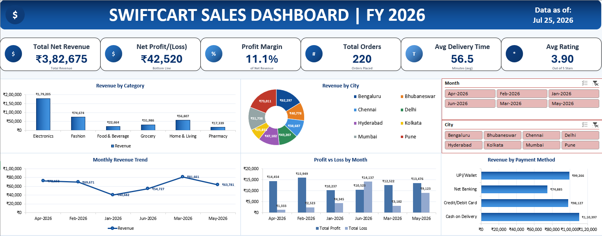
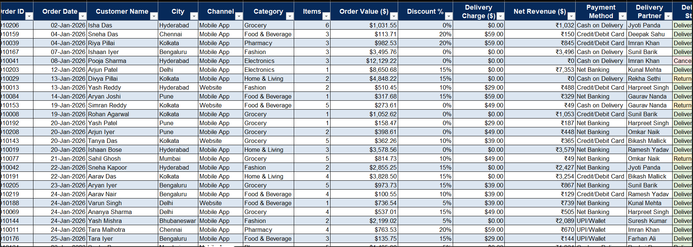
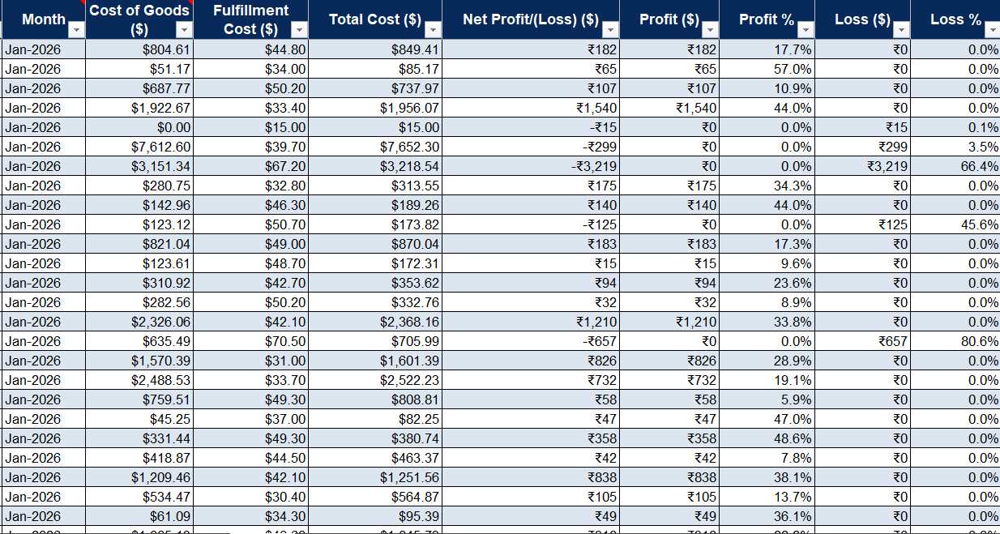
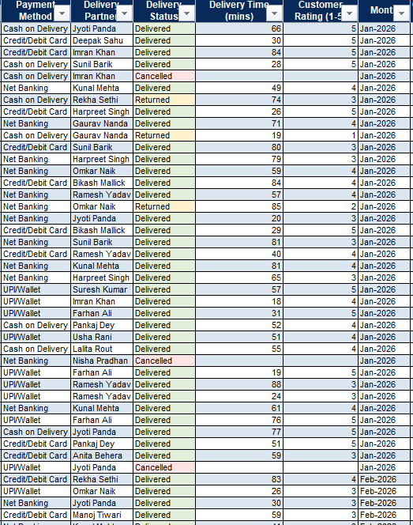
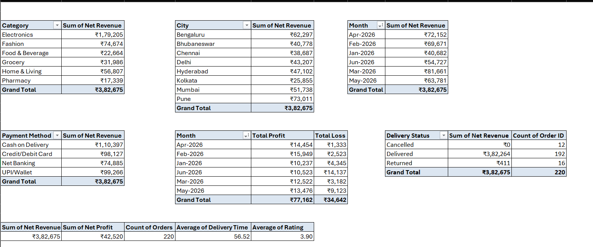
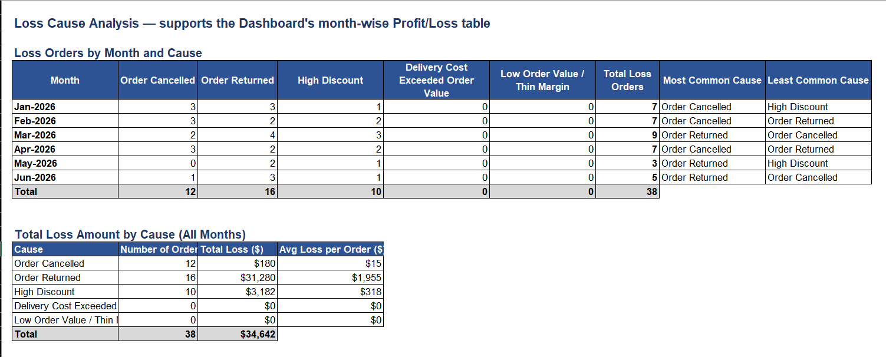

# 📊 SwiftCart Sales Dashboard

An interactive **Business Analytics Dashboard** built in **Microsoft Excel** to transform raw sales data into meaningful business insights and support data-driven decision-making.

---

## 🚀 Project Overview

Businesses generate large volumes of sales data every day, but raw data alone does not drive better decisions.

This project demonstrates how **Microsoft Excel** can be used as a powerful **Business Intelligence (BI)** tool by combining **Pivot Tables, Pivot Charts, KPI Cards, and Slicers** into a single interactive dashboard.

The dashboard enables stakeholders to monitor business performance, identify trends, compare key metrics, and make informed decisions through clear and interactive visualizations.

---

## 🎯 Project Objectives

- Analyze overall business performance
- Track revenue and profit trends
- Monitor customer purchasing behavior
- Identify high-performing product categories
- Create an interactive dashboard for business reporting
- Present business insights through data visualization

---

## 📈 Dashboard Features

- 📊 Revenue Analysis
- 💰 Profit Analysis
- 👥 Customer Analysis
- 📦 Product Performance Analysis
- 📈 KPI Cards
- 🎛 Interactive Slicers
- 📉 Dynamic Pivot Charts
- 📋 Pivot Tables

---

## 🛠️ Tools & Technologies

- Microsoft Excel
- Pivot Tables
- Pivot Charts
- Slicers
- Conditional Formatting
- Data Cleaning
- Dashboard Design
- Business Analytics

---

## 📷 Dashboard Preview

### Dashboard Overview



### Sales Analysis



### Profit Analysis



### Customer Analysis



### Pivot Table 



**Riders(HR)**
.png)


**Loss Analysis**



---


## 💡 Business Insights

- Identified top-performing product categories based on sales performance.
- Compared revenue and profit trends to evaluate business growth.
- Analyzed customer purchasing behavior to understand sales patterns.
- Built an interactive dashboard that enables faster business reporting and decision-making.

---

## 📈 Business Value

This dashboard helps business stakeholders to:

- Monitor key business KPIs in one place.
- Track revenue and profit performance.
- Analyze customer and product trends.
- Support data-driven strategic decisions.
- Generate interactive business reports with ease.

---

## 📂 Repository Structure

```
Business-Analytics-Excel-Dashboard/
│
├── SwiftCart_Sales_Dashboard.xlsx
├── README.md
├── LICENSE
├── .gitignore
└── Screenshots/
    ├── dashboard-overview.png
    ├── sales-analysis.png
    ├── profit-analysis.png
    ├── customer-analysis.png
    └── pivot-table.png
```

---

## 🚀 How to Use

1. Clone this repository.

```bash
git clone https://github.com/Bisu-1909a/Business-Analytics-Excel-Dashboard.git
```

2. Open **SwiftCart_Sales_Dashboard.xlsx** using **office viewer**.
3. Use the interactive slicers to explore sales performance, profit trends, customer behavior, and business KPIs.

---

## 👨‍💻 Author

**Biswajeet Ojha**

Aspiring Business Analyst

🔗 **LinkedIn:**
https://www.linkedin.com/in/biswajeet-ojha-9176a1387

🔗 **GitHub:**
https://github.com/Bisu-1909a

---

## ⭐ Support

If you found this project useful or interesting, consider giving it a **⭐ Star** on GitHub.

Feedback and suggestions are always welcome!
